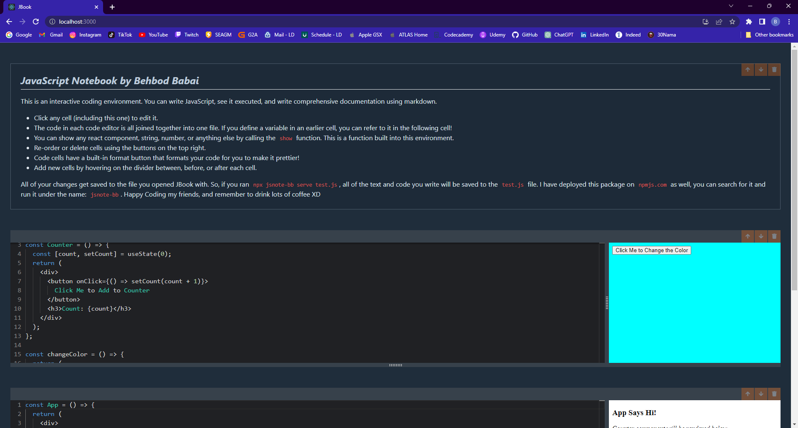

#

JavaScript Notebook

> This project is an interactive coding environment. You can write JavaScript, see it executed, and write comprehensive documentation using markdown.
>
> <!--Live demo [_here_]().  If you have the project hosted somewhere, include the link here. -->

## Table of Contents

- [General Info](#general-information)
- [Technologies Used](#technologies-used)
- [Screenshots](#screenshots)
- [Usage](#usage)
- [Project Status](#project-status)
- [Room for Improvement](#room-for-improvement)
- [Acknowledgements](#acknowledgements)
- [Contact](#contact)
<!-- * [License](#license) -->

## General Information

This web application is developed to showcase knowledge of developing responsive and interactive webpages using Typescript, React and managing the state
of the application using redux. The web app uses esbuild to bundle the user's code and also uses various libraries to do various things
eg. displaying a markdown editor, code editor ,etc. This application is an interactive coding environment. You can write JavaScript, see it executed, and write comprehensive documentation using markdown.

### Important Note: The link of this application takes you to a demo that is online. If you want to be able to save code and text for this application, You can use the npm package that I have published to npm and the local server will store and fetch code on your device. The package is saved on npmjs.com under the name: jsnote-bb

<!-- You don't have to answer all the questions - just the ones relevant to your project. -->

## Technologies Used

- npm - 8.15.0
- React.js
- Typescript
- Redux.js
- Node.js
- Express
- esbuild
- lerna
- HTML - version html5
- CSS
- git - version 2.38.1.windows.1
- github

## Screenshots

## Usage

This is an interactive coding environment. You can write JavaScript, see it executed, and write comprehensive documentation using markdown.

## Project Status

Project is: Complete

## Room for Improvement

- There is an issue currently with using hooks inside of function react components which can be addressed.

## Acknowledgements

- Many thanks to Udemy for including the this project on their React and Typescript: Build a Portfolio Project Course.

## Contact

Created by Behbod Babai - feel free to contact me via email!
my email: behibabai@gmail.com

<!-- Optional -->
<!-- ## License -->
<!-- This project is open source and available under the [... License](). -->

<!-- You don't have to include all sections - just the one's relevant to your project -->
